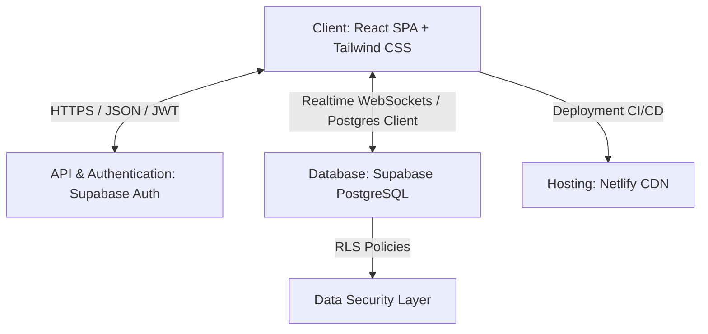
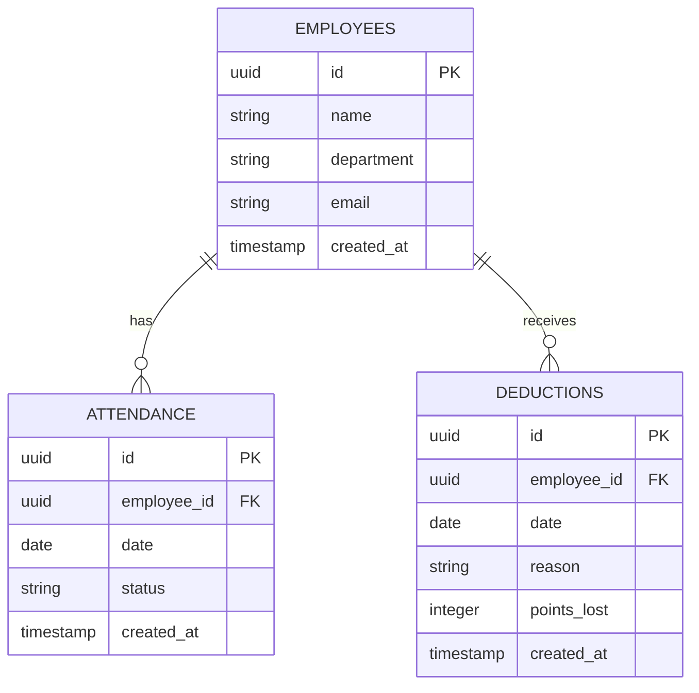

# Product Requirements Document (PRD)

## Project Name: Employee Attendance & Point Deduction System

---

## 1. Document Overview & Executive Summary

The **Employee Attendance & Point Deduction System** is a centralized web portal designed to streamline staff attendance tracking, automate allowance calculations, and manage point-based payroll deductions. The system serves two primary categories of users: **Administrators (HR/Admin)**, who manage employee profiles, log attendance, and run reports; and **Employees**, who log in to view their performance metrics, attendance history, and net payout.

By automating payroll rules and point deductions, the portal minimizes manual HR calculations, reduces payroll errors, and provides employees with a clear, transparent view of their earnings.

---

## 2. Core Business Rules

The system computes payroll metrics dynamically based on the following automated rules:

| Metric | Rule Description | Value / Formula |
| :--- | :--- | :--- |
| **Daily Allowance** | Provided for each working day marked as **Present**. | `Rs. 500` per day |
| **Maximum Weekly Allowance** | The cap on allowance earned per calendar week. | `Rs. 3,000` maximum |
| **Point Value** | Deduction value per assigned violation point. | `Rs. 100` per point |
| **Net Pay Calculation** | The final payout computed for an employee over a given period. | `Net Pay = Total Allowance - (Total Points * 100)` |

---

## 3. User Roles & Features

### 3.1. Administrator (HR/Admin) Features
* **Employee Management (CRUD):** Add, update, view, and soft-delete employee profiles (name, department, role, etc.).
* **Daily Attendance Logger:** A fast, intuitive matrix to mark attendance (`Present` or `Absent`) for all employees on any given date.
* **Point-Based Violation Logger:** Assign violation points to employees (e.g., late logins, policy breaches) with mandatory fields for `date`, `points_lost`, and `reason`.
* **Aggregated Summaries & Reporting:** 
  * View real-time, filterable dashboards showing weekly or monthly summaries.
  * Filter reports by week, month, or department.
  * Export reports to PDF or Excel formats.

### 3.2. Employee Features
* **Personalized Dashboard:** A secure login dashboard (via Supabase Auth) showing a clean overview of personal stats.
* **Metric Cards:** Immediate view of key statistics:
  * Total days worked.
  * Total accumulated violation points.
  * Total computed gross allowance.
  * Net pay after deductions.
* **Attendance & Deduction Log:** A detailed list of personal attendance logs and deduction history with specific dates and reasons.
* **Quick Links:** Shortcuts to download or print historical monthly statements.

---

## 4. UI/UX Design System

To ensure high usability, the user interface will be minimal, modern, and highly focused, using white space and a clean design language to reduce cognitive load.

### 4.1. Design Aesthetics & Layout
* **Typography:** Modern, clean sans-serif typeface (e.g., **Inter** or **Outfit**) loaded via Google Fonts.
* **Color Palette:** A cohesive, professional dark/light palette with tailored HSL values:
  * Primary brand color (sleek slate/indigo).
  * Status-based badges (e.g., soft green for `Present`, soft red/coral for `Absent`, soft yellow/orange for `Deductions`).
* **Unified Dashboard Architecture:**
  * **Sidebar Navigation:** Sticky vertical menu containing links to Dashboards, Employees, Attendance, Violations, and Reports.
  * **Inverted Pyramid Layout:** The most critical metrics (Total Allowances, Days Worked, Total Points, Net Pay) are displayed at the very top using prominent "Metric Cards." Detailed data tables and charts are positioned below.
* **Clear Calls-to-Action (CTAs):** High-contrast buttons with hover states (e.g., "Add Employee" in vibrant blue, "Submit Attendance" in solid green) to draw attention to critical workflows.
* **Interactive Elements:** Smooth micro-animations on interactive tables, hover effects on navigation items, and interactive charts displaying monthly trends.
* **Mobile Responsiveness:** A fully responsive grid layout that adapts cleanly to mobile devices, tablets, and desktop displays.

---

## 5. Technical Architecture & Tech Stack



### 5.1. Frontend
* **Core:** React Single-Page Application (SPA) built using **Vite** for rapid hot-module replacement and optimized production builds.
* **Styling:** **Tailwind CSS** using its Just-In-Time (JIT) compiler to generate minimal, purged stylesheets.
* **Performance Enhancements:**
  * Component memoization using `React.memo`, `useCallback`, and `useMemo` to minimize unnecessary re-renders.
  * Route-based code-splitting utilizing `React.lazy` and `Suspense`.
  * Virtualized lists (e.g., using `react-window` or `react-virtual`) for handling long historical logs.

### 5.2. Backend & Database
* **Platform:** **Supabase** (Fully managed PostgreSQL database + Auth + Real-time engine).
* **Real-time Synchronization:** WebSockets subscription to listen to changes on the `attendance` and `deductions` tables, pushing updates immediately to the Admin control board.
* **Auth System:** JWT-based user management with secure sign-up/login flows.

### 5.3. Hosting & CI/CD
* **Platform:** **Netlify**
* **Deployment Workflow:** Connected to the project's Git repository. Any push to the main branch automatically triggers the production build pipeline and deploys to Netlify’s global CDN.
* **Environment Configuration:** Netlify integration with Supabase automatically syncs the required `SUPABASE_URL` and `SUPABASE_ANON_KEY` variables to the build environment.

---

## 6. Database Schema (PostgreSQL)



### 6.1. Table Definitions

#### `employees`
Tracks core employee profiles. Linked to Supabase Auth `users` table via `id`.
```sql
CREATE TABLE public.employees (
    id UUID PRIMARY KEY REFERENCES auth.users(id) ON DELETE CASCADE,
    name VARCHAR(255) NOT NULL,
    department VARCHAR(100) NOT NULL,
    created_at TIMESTAMP WITH TIME ZONE DEFAULT TIMEZONE('utc'::text, NOW()) NOT NULL
);
```

#### `attendance`
Tracks daily presence and absence. A compound unique index prevents duplicate entries.
```sql
CREATE TABLE public.attendance (
    id UUID PRIMARY KEY DEFAULT gen_random_uuid(),
    employee_id UUID NOT NULL REFERENCES public.employees(id) ON DELETE CASCADE,
    date DATE NOT NULL,
    status VARCHAR(10) CHECK (status IN ('Present', 'Absent')) NOT NULL,
    created_at TIMESTAMP WITH TIME ZONE DEFAULT TIMEZONE('utc'::text, NOW()) NOT NULL,
    CONSTRAINT unique_employee_date UNIQUE (employee_id, date)
);
```

#### `deductions`
Records infraction events and deduction points.
```sql
CREATE TABLE public.deductions (
    id UUID PRIMARY KEY DEFAULT gen_random_uuid(),
    employee_id UUID NOT NULL REFERENCES public.employees(id) ON DELETE CASCADE,
    date DATE NOT NULL,
    reason TEXT NOT NULL,
    points_lost INTEGER CHECK (points_lost >= 0) NOT NULL,
    created_at TIMESTAMP WITH TIME ZONE DEFAULT TIMEZONE('utc'::text, NOW()) NOT NULL
);
```

### 6.2. Indexes & Performance Optimization
To speed up query processing and report generation, the following indexes are defined:
```sql
CREATE INDEX idx_attendance_date ON public.attendance(date);
CREATE INDEX idx_attendance_employee ON public.attendance(employee_id);
CREATE INDEX idx_deductions_employee_date ON public.deductions(employee_id, date);
```

---

## 7. Security and Data Privacy (RLS Policies)

Row-Level Security (RLS) is enabled on all tables to enforce strict data privacy, ensuring that employees can only view their own records while Admins have full access.

### 7.1. Database Role Mapping
* `authenticated` role represents logged-in users.
* An `is_admin` boolean flag or role-based check is used to differentiate Admins from Employees. (For simplicity, an admin role check can query an `admins` table or verify metadata in the JWT).

### 7.2. RLS SQL Policies

#### Employees Table Policy
```sql
ALTER TABLE public.employees ENABLE ROW LEVEL SECURITY;

-- Admins can do everything
CREATE POLICY admin_all_employees ON public.employees 
    FOR ALL USING (auth.jwt() ->> 'email' IN (SELECT email FROM public.admins));

-- Employees can read their own profile
CREATE POLICY employee_read_own ON public.employees 
    FOR SELECT USING (auth.uid() = id);
```

#### Attendance Table Policy
```sql
ALTER TABLE public.attendance ENABLE ROW LEVEL SECURITY;

-- Admins can manage all attendance logs
CREATE POLICY admin_all_attendance ON public.attendance 
    FOR ALL USING (auth.jwt() ->> 'email' IN (SELECT email FROM public.admins));

-- Employees can view only their own attendance logs
CREATE POLICY employee_read_own_attendance ON public.attendance 
    FOR SELECT USING (auth.uid() = employee_id);
```

#### Deductions Table Policy
```sql
ALTER TABLE public.deductions ENABLE ROW LEVEL SECURITY;

-- Admins can manage all deductions
CREATE POLICY admin_all_deductions ON public.deductions 
    FOR ALL USING (auth.jwt() ->> 'email' IN (SELECT email FROM public.admins));

-- Employees can view only their own deductions
CREATE POLICY employee_read_own_deductions ON public.deductions 
    FOR SELECT USING (auth.uid() = employee_id);
```

---

## 8. Verification & QA Plan

### 8.1. Automated Verification
* Run unit tests on calculation hooks:
  * Validate that 5 working days yield `Rs. 2500` allowance.
  * Validate that 7 working days are capped at `Rs. 3000` allowance (not `Rs. 3500`).
  * Verify that a 3-point deduction subtracts exactly `Rs. 300`.
* Database constraint verification: Attempting to insert a duplicate date for an employee's attendance should trigger a violation.

### 8.2. Manual Verification
* Cross-browser styling and layout rendering testing.
* Emulating low-bandwidth/mobile screen dimensions in DevTools to check grid transitions.
* Inspecting network requests to ensure token authentication headers are sent on all database requests.
